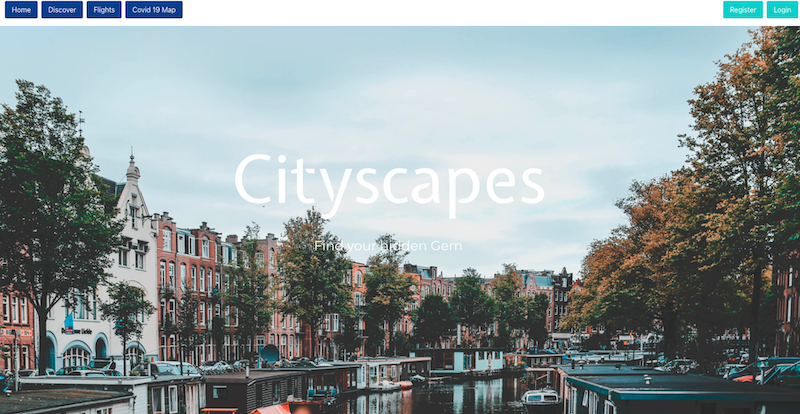
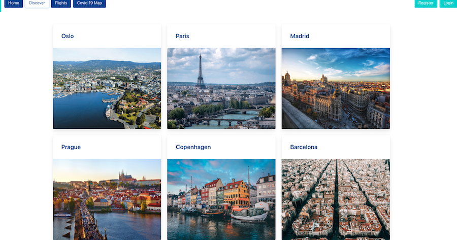
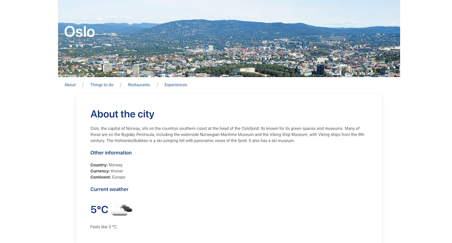
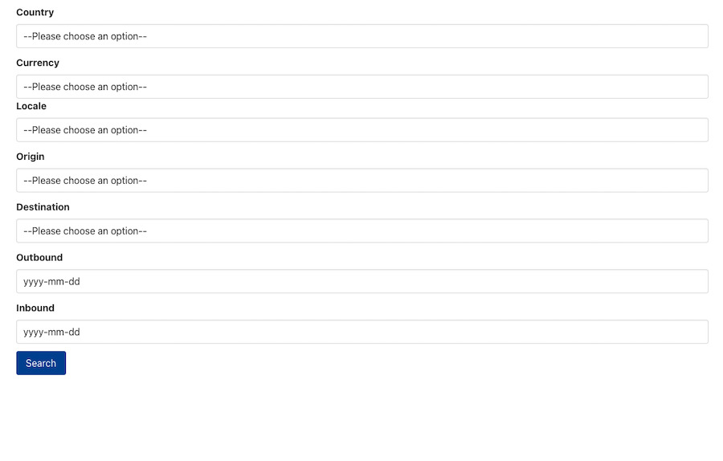
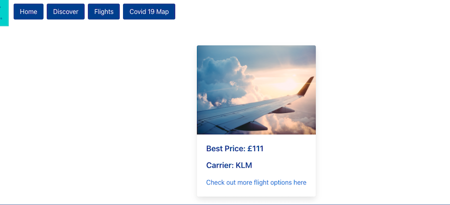

# project-3


# Project-3 - Cityscapes, a MERN Stack Application.




For my third project at General Assembly's Software Engineering Immersive cousre my
classmates  [Benjamin Shamash](https://github.com/shammyb), [Eva Novotna](https://github.com/novoeva) and [Natasha Alderson](https://github.com/nalderson) and I built Cityscapes.

The app has been deployed on Heroku and you can find it [here](https://project-cityscapes.herokuapp.com/)

## Brief 

* Build a full-stack application by making your own backend and your own front-end
* Use an Express API to serve your data from a Mongo database
* Consume your API with a separate front-end built with React
* Be a complete product which most likely means multiple relationships and CRUD functionality for at least a couple of models
* Implement thoughtful user stories/wireframes that are significant enough to help you know which features are core MVP and which you can cut
* Have a visually impressive design
* Be deployed online so it's publicly accessible


## Technologies Used:


* Express
* MongoDB
* Mongoose
* React
* Node.js
* JWT
* Bcrypt
* Axios
* GitHub
* Git
* Bulma CSS
* MapboxGL
* Supertest
* Chai
* Mocha


### APIs Used:
* skyscanner
* foursquare
* openweathermap
* trackcorona


## Cityscapes

For the third project of the General Assembly Software Immersive Course we were tasked as a group 
to build a full stack application. The duration of the project was 9 days and worked in a group of four. As a group we decided
we wanted to build a travel site. During the planning stage we identified what functionality the site would need so we sourced the internet
for APIs we could leverage. 


We used the Skyscanner API on the Flights page which would return the best price for the flight to the requested location.
We also used the foursquare API on our city pages to return a list of things to do in that city as well as a list of top restaurants for that city.
The individual city page also has current weather for that city using the openweathermap API. Registered users are able to login and post cities  as well
as posting a comment on a city.








## Project overview


We began by planning out how our models would look like and how the site would look on our front-end whilst also discussing all the functionality we needed. We also identified the APIs we needed and then proceeded to build the back-end. We built our own API
for the city data, Each city would consist of fields such about, currency, language, image, continent, longitude & latitude. Within the  city model we have a referenced relationship with our user model , inside the citySchema we reference the userSchema, we also have an embedded commentSchema in our citySchema.


```
import mongoose from 'mongoose'
import uniqueValidator from 'mongoose-unique-validator'

// city schema with embedded schema
const commentSchema = new mongoose.Schema({
  title: { type: String, required: true },
  comment: { type: String, required: true },
  image: { type: String },

  user: { type: mongoose.Schema.ObjectId, ref: 'User', required: true }
}, { 
  timestamps: true
})


const citySchema = new mongoose.Schema({
  city: { type: String, required: true },
  about: { type: String },
  country: { type: String },
  currency: { type: String },
  continent: { type: String },
  language: { type: String },
  image: { type: String, required: true },
  long: { type: String },
  lat: { type: String },
  user: { type: mongoose.Schema.ObjectId, ref: 'User', required: true },
  comments: [ commentSchema ]
  
})

citySchema.plugin(uniqueValidator)

export default mongoose.model('City', citySchema)
```

We decided that we would collectively build the back-end completing our MVC, once the back-end was completed we moved onto the front-end, we achieved this quite early on as we kept each other notified of our progress on slack and built up a positive team dynamic where we were able to communicate effectively and help each other out when we encountered any stumbling blocks. We then decided to split up the tasks for the front-end.


Each team member was delegated a component that they would build.
I took ownership of the discover page and the Covid 19 map. The discover page consists  of the all the citys in our database, the cities are mapped out
in bulma cards and when clicked on will take you to that cities  page where all the information on that city is displayed. For the Covid19 map
I used Mapbox GL for the map and then used the trackcorona API so I could map the data for each country and then place markers on the map for each country
so when clicked it will display a pop up of the latest corona virus statistics.

```
export default function Map() {

  const [loading, updateLoading] = useState(true)
  const [cities, updateCities] = useState({})
  const [choosenCity, setChoosenCity] = useState(null)

  const [viewport, setViewport] = useState({
    latitude: 54.5260,
    longitude: 15.2551,
    width: '100vw',
    height: '100vh',
    zoom: 3.5

  })
  useEffect(() => {
    async function getCities() {
      try {
        const { data } = await axios.get('https://www.trackcorona.live/api/countries')
        
        updateCities(data.data)

        updateLoading(false)
        
      } catch (err) {
        console.log(err)
      }
    }
    getCities()
  }, [])


  if (loading) {
    return <ClipLoader loading={loading} size={100} />
  } 

  return <div>

    <ReactMapGL {...viewport}
      mapboxApiAccessToken={process.env.REACT_APP_MAPBOX_TOKEN}
      mapStyle='mapbox://styles/aozzy/ckll7cr0x22z317nn84cgk3ew'
      onViewportChange={viewport => {
        setViewport(viewport)
      }}


    >

      {cities.map(city => (
        <Marker
          key={city._id}
          latitude={city.latitude}
          longitude={city.longitude}
          

        >
          <button className='marker-btn' onClick={(event) => {
            event.preventDefault()
            setChoosenCity(city)
          }} >
            
          </button>
        </Marker>

      ))}


      {choosenCity ? (
        <Popup latitude={choosenCity.latitude}
          longitude={choosenCity.longitude} onClose={() => {
            setChoosenCity(null)
          }} >
          <div>
            <h2> Confirmed Cases: {choosenCity.confirmed} </h2>
            <h2> Death Toll: {choosenCity.dead} </h2>
            <h2> Recovered: {choosenCity.recovered}  </h2>
          </div>
        </Popup>
      ) : null}
    </ReactMapGL>

  </div>


}
```

## Tests

Using Supertest Mocha and chai and wrote four tests for this project. The first test would check to see we get the 200 status code when making
a get request to our cities endpoint.

```
it('should return a 200 response', done => {
    api.get('/api/cityscapes')
      .end((err, res) => {
        expect(res.status).to.eq(200)
        done()
      })
  })
```

The second test was to ensure that we get back an array of 15 cities  in setup.js file.


```
it('should return an array of 15 cities ', done => {

    api.get('/api/cityscapes')
      .end((err, res) => {

        expect(res.body).to.be.an('array')
        expect(res.body.length).to.eq(15)
        done()
      })
  })
```

We have a secure route setup so only authenticated users are able to post new citys, The third test is to ensure we get back a status code of 401 unauthorised when trying to post a city.

```
it('This endpoint requires Authentication', done => {

    api.post('/api/cityscapes')

      .send({
        city: 'Amsterdam',
        about: 'Amsterdam is the Netherlands capital, known for its artistic heritage, elaborate canal system and narrow houses with gabled facades, legacies of the citys 17th-century Golden Age. Its Museum District houses the Van Gogh Museum, works by Rembrandt and Vermeer at the Rijksmuseum, and modern art at the Stedelijk. Cycling is key to the citys character, and there are numerous bike paths.',
        country: 'The Netherlands',
        currency: 'Euro',
        continent: 'Europe',
        language: 'Dutch',
        image: 'https://i1.wp.com/dutchsfcommunity.org/wp-content/uploads/2019/03/Amsterdam-Canals.jpg?fit=2048%2C1536&ssl=1',
        long: '5.2913',
        lat: '52.1326'
        
      })
      .end((err, res) => {
        expect(res.status).to.eq(401)
        


        done()
      })
  })
```

The fourth test is to ensure that a new user is able register and then login.

```
it('Should be able to register user, then login a new user', done => {

    api.post('/api/register')
      
      .send({
        username: 'testuser',
        email: 'testemail@testdomain.com',
        password: 'letmein123',
        passwordConfirmation: 'letmein123'
      })
      .end((err, res) => {
        expect(res.status).to.eq(201)
        expect(res.body.username).to.eq('testuser')

        
        api.post('/api/login')
          .send({
            email: 'testemail@testdomain.com',
            password: 'letmein123',
            passwordConfirmation: 'letmein123'
          })
          .end((err, res) => {
            expect(res.status).to.eq(202)
            expect(res.body.token).to.be.a('string')

            done()
          })
      })
  })

```

## Future Features

* Add Cloudinary for image uploads 
* Make landing page fully responsive for mobile devices


## Bugs
* The Cityscapes logo is distorted when viewing on Safari
* The discover page requires loading state as sometimes the content doesn't appear which may require the user to wait a little longer
for the content to appear.

## Key learnings
Project 3 was a throughly enjoyable yet challenging experience, It tested our skills of the technologies used as we had only just been taught about Express MongoDB and Mongoose as well as testing using Supertests Mocha and Chai. This project boasted my collaborative and debugging skills as we would push our changes from our feature branches to the development branch on Git and then pull from the development branch and resolve any conflicts in the code, this process meant that we were always in communication with each other and stressed the importance of communication when working in a group.